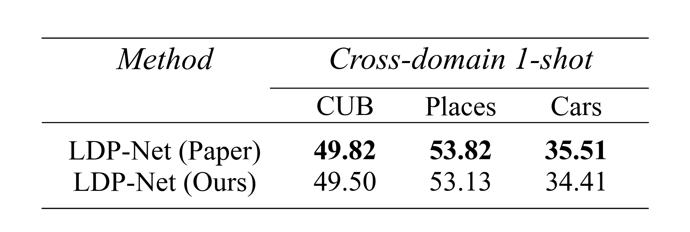
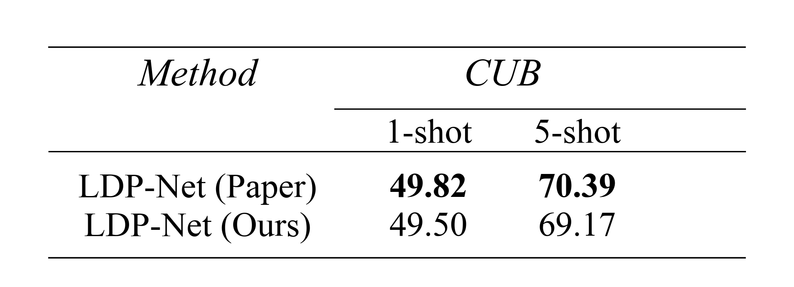

# 基于 LibFewShot 的 LDP-Net 算法复现

本仓库基于 [LibFewShot](https://github.com/RL-VIG/LibFewShot) 框架，复现论文 **Revisiting Prototypical Network for Cross-Domain Few-Shot Learning (CVPR 2023)** 中的 LDP-Net 方法。

论文链接：[CVPR 2023 Paper](https://openaccess.thecvf.com/content/CVPR2023/html/Zhou_Revisiting_Prototypical_Network_for_Cross_Domain_Few-Shot_Learning_CVPR_2023_paper.html)  
官方代码：[NWPUZhoufei/LDP-Net](https://github.com/NWPUZhoufei/LDP-Net)

## 项目内容

- 在 LibFewShot 框架中接入 LDP-Net
- 使用 miniImageNet 进行训练
- 在 CUB、Places365、StanfordCar 上进行 cross-domain few-shot 测试
- 对照论文和官方代码调整训练、测试和特征处理流程

## 环境配置

```bash
git clone https://github.com/Kaka22-8/Reproduction-of-the-LDP-net-Based-on-LibFewShot.git
cd Reproduction-of-the-LDP-net-Based-on-LibFewShot/LibFewShot
conda create -n libfewshot python=3.8
conda activate libfewshot
pip install -r requirements.txt
```

PyTorch 请根据本机 CUDA 版本安装，参考 [PyTorch 官方安装说明](https://pytorch.org/get-started/locally/)。

## 数据集与预训练模型

本项目使用的数据集和预训练模型均来自 LDP-Net 官方论文仓库提供的下载链接：

[LDP-Net Official Repository](https://github.com/NWPUZhoufei/LDP-Net)

当前实验使用：

- miniImageNet：训练集
- CUB：跨域测试集
- Places365：跨域测试集
- StanfordCar：跨域测试集

下载后需要按 LibFewShot 的读取逻辑整理数据路径，并在配置文件或测试脚本中修改 `data_root`。

训练配置示例：

```yaml
data_root: D:/datasets/miniImageNet--ravi
```

测试配置示例：

```python
VAR_DICT = {
    "data_root": "D:/datasets/CUB_200_2011_FewShot",
    "test_way": 5,
    "test_shot": 1,
    "test_query": 15,
    "test_episode": 600,
}
```

预训练模型请放到：

```text
LibFewShot/pretrain/399_state.pth
```

对应配置为：

```yaml
pretrain_path: ./pretrain/399_state.pth
```

数据集格式可参考 [LibFewShot 数据集格式文档](https://libfewshot-en.readthedocs.io/zh-cn/latest/tutorials/t2-add_a_new_dataset.html)。

## 训练

进入内层代码目录后运行：

```bash
cd LibFewShot
python run_trainer.py
```

当前训练入口默认读取：

```python
Config("./config/ldp_net_miniimagenet.yaml")
```

训练结果默认保存到：

```text
LibFewShot/results/
```

## 测试

测试前修改 `run_test.py` 中的 `PATH`，使其指向训练生成的实验目录：

```python
PATH = "./results/LDPNet-miniImageNet--ravi-resnet10-5-5-Apr-15-2026-10-01-59"
```

然后根据目标测试集修改 `VAR_DICT` 中的 `data_root`、`test_shot` 等参数：

```bash
python run_test.py
```

## 复现设置

- Training dataset: miniImageNet
- Backbone: ResNet10
- Setting: 5-way 1-shot
- Query number: 15
- Test episodes: 600
- Evaluation: cross-domain few-shot classification

## 复现结果

复现结果如下：





## 项目结构

```text
Reproduction-of-the-LDP-net-Based-on-LibFewShot/
├── README.md
└── LibFewShot/
    ├── config/
    │   ├── ldp_net_miniimagenet.yaml
    │   └── ldp_net_CUB.yaml
    ├── core/
    │   └── model/
    │       └── metric/
    │           └── ldp_net.py
    ├── pretrain/
    │   └── README.md
    ├── results/
    │   └── README.md
    ├── run_trainer.py
    ├── run_test.py
    └── requirements.txt
```

## 说明

数据集、预训练模型、训练 checkpoint 和完整日志不直接上传到 GitHub。需要复现实验时，请从 LDP-Net 官方仓库下载数据和预训练模型，并按 README 中的路径放置。

## 致谢

- [LibFewShot](https://github.com/RL-VIG/LibFewShot)
- [LDP-Net Official Code](https://github.com/NWPUZhoufei/LDP-Net)
- Zhou et al., Revisiting Prototypical Network for Cross-Domain Few-Shot Learning, CVPR 2023
